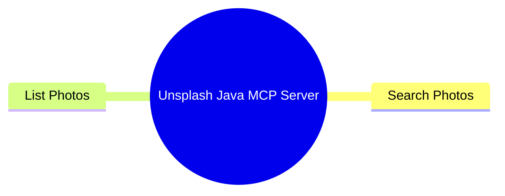
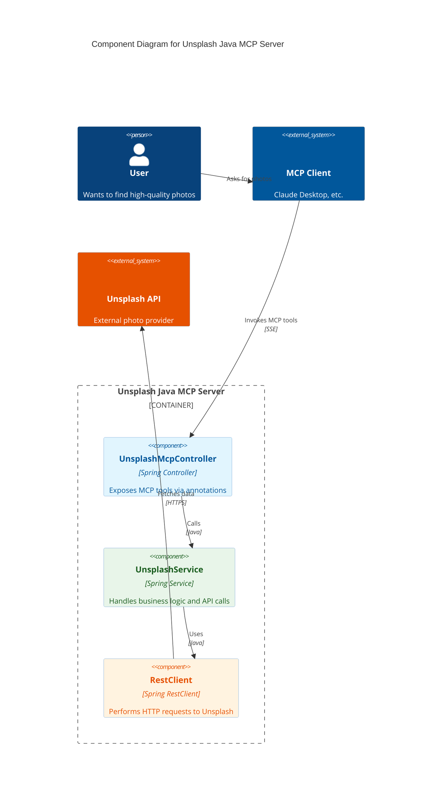
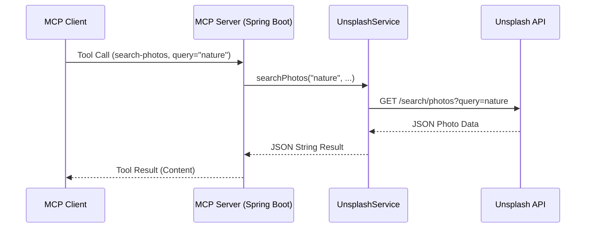

# Architecture Documentation – Unsplash Java MCP Server

This document describes the architecture, use cases, and technical implementation of the Unsplash Model Context Protocol (MCP) server.

## Overview

The Unsplash Java MCP Server is a Spring Boot application that enables LLMs (Large Language Models) to interact with the Unsplash API. It implements the [Model Context Protocol](https://modelcontextprotocol.io), allowing any MCP-compatible client (like Claude Desktop) to search and list high-quality photos.

## Use Cases

### 1. Photo Search
**Goal:** Allow the LLM to find specific images based on user descriptions.
- **Tool:** `search-photos`
- **Parameters:** `query`, `page`, `perPage`, `orderBy`, `collections`, `contentFilter`, `color`, `orientation`, `lang`.
- **Functionality:** Forwards the search request to the Unsplash API and returns a structured JSON response containing photo details, URLs, and metadata.

### 2. Photo Listing
**Goal:** Allow the LLM to browse the latest or popular photos.
- **Tool:** `list-photos`
- **Parameters:** `page`, `perPage`.
- **Functionality:** Retrieves a list of photos from the Unsplash "editorial" or "latest" feed.

### Use Case Diagram

The following mind map illustrates the primary use cases and interactions for the Unsplash Java MCP Server.

## System Architecture

The server is built using Java 21 and Spring Boot, leveraging the `spring-ai-mcp` library for protocol implementation.

### Component Diagram

### Sequence Diagram: Tool Execution

The following diagram illustrates how a tool call (e.g., `search-photos`) is processed.

## Implementation Details

### Technology Stack
- **Framework:** Spring Boot 3.5.9
- **Protocol:** Model Context Protocol (MCP)
- **Library:** `spring-ai-starter-mcp-server-webmvc`
- **HTTP Client:** Spring `RestClient`
- **Language:** Java 21

### Key Components
- **`UnsplashMcpController`**: Defines the MCP tools using `@McpTool` and `@McpToolParam` annotations.
- **`UnsplashService`**: Encapsulates the logic for interacting with the Unsplash REST API.
- **`CorsProperties` & `WebConfig`**: Handles CORS configuration for SSE (Server-Sent Events) transport.

## References & Samples

For practical examples and configuration snippets, refer to:

- **[mcp.jsonl](mcp.jsonl)**: Example configuration for adding this server to an MCP client.
- **[unsplash.http](unsplash.http)**: Sample HTTP requests to test the Unsplash API and the MCP endpoints manually.
- **[README.md](../README.md)**: Main project documentation with setup and running instructions.
